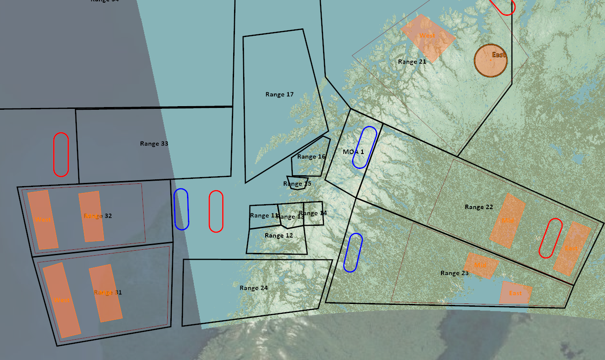

# Range Drones
ver 2.3

The new range drone system is in testing in the following Ranges: 

Range 21
Range 22
Range 23
Range 31
Range 32

## Air 2 Air Advesary Script Function

The controlling script is singular and modular in that it is reused by each range. Therefore any range could have an A2A Averasy option. 

## Drone units
The system currently includes: 
- MIG23MLD (*APU602M*, R24R)
- MIG29A (*R60M*, R73, R27R)
- SU30 (*R73*, R77, R27ER)
- JF17 (*PL-5EII*, SD10-A)
- MIG25PD (*R40TD*, R40RD)
- MIG31 (*R73*, R77, R29ER)
- SU27 (*R73*, R27ET, R27ER)
- J11A (*R73*, R27ER, R77)

\* *italics* shows the BFM load  

## Control
Select mode **BVR** or BFM  
This defines the load and max detection range of the drone groups.  
BVR max detection range ~120nm.  
BFM max detection range ~30nm. 

Groups 1-4 allow the configuration of your required engagement airframes that can be configured through the Group Config Menu even before you leave the ground. 

## Enemy ROE
- Drones groups execute a CAP mission in the vacinity of their spawn zone when they are first spawned. 
- Drones will only engage targets inside the range.
- Max detection range is only the possible maximum, it might be short (DCS mechanics)
- Engagement range is not configurable. (see note)
*Note: the engagement range is defined as maximum range in the drone templates, but their skill is set to average else they are impossible to beat, the side effect is that low skilled drones engage closer. There is no way around this.*

## Zone Violation
- Drones will not engage target outside the zone. 
- However, they wiull persue pre-engaged targets outside their zone. 
- Once the targets are eliminated they will return to their Spawn zone.  

## Back
[Back to frontpage](https://132nd-vwing.github.io/TRMA-Brief/)
