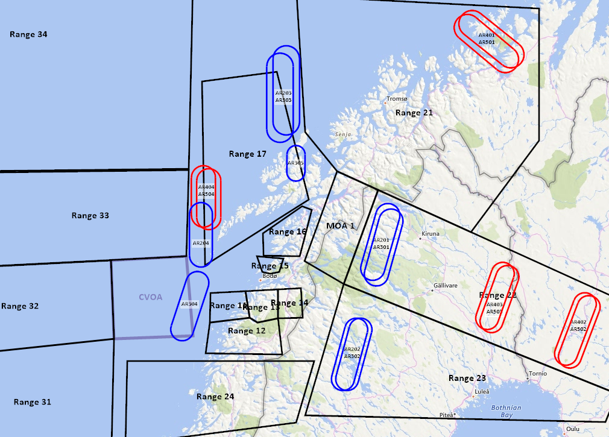

# Tanker information

All tankers need to be activated via F10 menu.

## BLUEFOR

### KC-135

**FLIGHT** | **TRACK**  | **FL** | **TACAN** | **FREQUENCY** | **IFF**  |
 --------- | -----------| ------ | ------    | -----------   | -------- | 
**ARCO 1**   | AR 201     | 200    | 40Y       | 280.0 MHz     | 5201     | 
**ARCO 2**   | AR 202     | 200    | 41Y       | 281.0 MHz     | 5202    | 
**ARCO 3**   | AR 203     | 200    | 42Y       | 282.0 MHz     | 5203     | 
**ARCO 4**   | AR 204     | 200    | 42X       | 286.5 MHz     | 5204     |

**TEXACO 1** | AR 101      | 120   | 37Y       | 283.5 Mhz     | 5101     |
**TEXACO 2** | AR 102      | 120   | 38Y       | 287.5 Mhz     | 5102     |

### KC-135 MPRS

**FLIGHT** | **TRACK**  | **FL** | **TACAN** | **FREQUENCY** | **IFF**  | 
 --------- | -----------| ------ | ------    | -----------   | -------- | 
**SHELL 1**  | AR 301     | 240    | 46Y       | 289.0 MHz     | 5301    | 
**SHELL 2**  | AR 302     | 240    | 47Y       | 288.0 MHz     | 5302     | 
**SHELL 3**  | AR 303     | 240    | 48Y       | 287.0 MHz     | 5303     | 
**SHELL 4**  | AR 304     | 240    | 49Y       | 286.0 MHz     | 5304     | 

### KC-130 MPRS

**FLIGHT** | **TRACK**  | **FL** | **TACAN** | **FREQUENCY** | **IFF**  | 
 --------- | -----------| ------ | ------    | -----------   | -------- | 
**SHELL 5**  | AR 305     | 050   | 46X      | 281.5 MHz     | 5305    | 

## REDFOR

### KC-135

**FLIGHT** | **TRACK**  | **FL** | **TACAN** | **FREQUENCY** | **IFF**  | 
 --------- | -----------| ------ | ------    | -----------   | -------- | 
**ARCO 6**  | AR 401     | 200    | 43Y       | 283.0 MHz     | 5401    | 
**ARCO 7**  | AR 402     | 200    | 44Y       | 284.0 MHz     | 5402    | 
**ARCO 8**  | AR 403     | 200    | 40X       | 284.5 MHz     | 5403    | 
**ARCO 9**  | AR 404     | 200    | 41X       | 282.5 MHz     | 5404    | 

### KC-135 MPRS

**FLIGHT** | **TRACK**  | **FL** | **TACAN** | **FREQUENCY** | **IFF**  | 
 --------- | -----------| ------ | ------    | -----------   | -------- | 
**SHELL 6**  | AR 501     | 240    | 39Y       | 285.0 MHz     | 5501     | 
**SHELL 7**  | AR 502     | 240    | 43X       | 280.5 MHz     | 5502     | 
**SHELL 8**  | AR 503     | 240    | 44X       | 285.5 MHz     | 5503     | 
**SHELL 9**  | AR 504     | 240    | 48X       | 288.5 MHz     | 5504     | 

## Tanker control

Tankers are spawned and controlled from the F10 menu:

`F10 -> AWACS and TANKER Control -> TANKER Control -> Blue Tankers -> Boom | Drogue`

`F10 -> AWACS and TANKER Control -> TANKER Control -> Red Tankers`

Before a tanker is airborne its entry is just **Spawn ARxxx**. Once it spawns, that entry
is replaced by a submenu whose title carries the tanker's current state:

    AR201 (20000 ft, 300 kt IAS)
      Climb 1000 ft
      Descend 1000 ft
      IAS +10 kt
      IAS -10 kt
      Despawn AR201

So you can read what a tanker is doing off the menu without having to ask it.

### Limits

|              | **STEP**  | **MIN**      | **MAX**      |
| ------------ | --------- | ------------ | ------------ |
| **Altitude** | 1000 ft   | 3000 ft      | 45000 ft     |
| **Speed**    | 10 kt     | 150 kt IAS   | 350 kt IAS   |

Altitude is barometric. A request outside those limits is refused, nothing changes, and
you get a message saying so. Asking a tanker that is not airborne to change anything gets
*"ARxxx is not airborne."*

### Notes

* Speed is commanded and displayed as **indicated** airspeed — what you fly to on the
  boom. DCS works in true airspeed underneath, so the speed is re-issued on every altitude change.
* A tanker starts on its briefed orbit altitude and speed as listed in the tables above,
  rounded to the nearest step. Your first change is relative to those, not to some
  arbitrary default.
* **The menu is mission-wide.** Any player can move any tanker, and every change is
  announced to everyone. Coordinate on the radio first.
* **Use with care — there are no guards.** Nothing stops a tanker being sent climbing or
  descending while someone is plugged in. Do not change altitude or speed with receivers on the boom.
* **List Active Tankers** reports each operating tanker's current altitude and IAS.
* A despawn clears the stored altitude and speed. Spawning the tanker again brings it
  back on its briefed numbers.

## Locations
See CombatFlite file for locations

 
 
 
 

## Back
[Back to frontpage](https://132nd-vwing.github.io/TRMA-Brief/)
