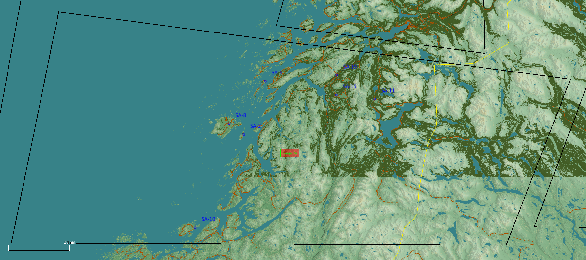

# Range 24

## SAM training
### Static SAMs
The range have three different static sites on the west coast of the range.
* SA-10: N65 05.966 E011 43.241 Elevation 74ft
* SA-2:  N65 37.798 E012 10.405 Elevation 59ft
* SA-6:  N65 55.846 E012 21.025 Elevation 30ft

### Target with mobile SAM as point protection
The range have 4 different mobile target areas. Each target area have a rocket artillery BN as the target at the center of the coordinates given. 
Each target site is protected by a dedicated SAM system. The SAM will spawn within 0-5nm away from the rocket artillery BN.
* SA-8:  N65 40.570 E011 57.825 Elevation 36ft
* SA-19: N66 00.730 E013 16.420 Elevation 118ft
* SA-15: N65 54.400 E013 18.000 Elevation 143ft
* SA-11: N65 54.472 E013 48.444 Elevation 1027ft

### Target with enemy IADS protection
The range have a rocket artillery BN protected by army IADS. The rocket artillery BN as the target have the coordinate below as the center.
* N65 35.800 E013 59.650 Elevation 716ft

### Locations

### ADMIN
- All SAMs need to be activated and decativated using the F10 menu.
- Rocket artillery BNs as targets for mobile SAMs will activate when you active the dedicated SAM system.

-------------------------------------------------------------

## ARMED RECONNAISSANCE   
#### SITUATION
**Friendlies:
BLUELAND in the NORTH have been invaded by REDLAND in the SOUTH.
Friendly forces consisting of two companies from a mechanized infantry battalion and are located in defensive positions protecting HEMAVAN airstrip and FOB. 
Friendly forces have established a FLOT about 2nm SOUTH of the airstrip with a platoon of IFV's.
Friendly forces are in defensive positions awaiting resupply  by logistical flights from Bodø.
Friendly forces have forward observers operating in the high ground supporting the defensive effort (JTAC North and JTAC South locations).

**Enemy:
Main enemy forces and REDLAND is located further SOUTH and EAST. REDLAND is on an offensive toward the NORTH to seize control of BLUELAND.
Enemy force are a armor brigade (intelligence from 24 hours ago). 
It is an intelligence gap if the enemy armored brigade have been reinforces with Corps or Division assets. 

**Enemy most likely COA (ML COA):
Offensive on one road axis toward HEMAVAN with one armored company at the time. Enemy air defence assets protecting artillery and high value assets in the rear area.

**Enemy most dangerous COA (MD COA):
Offensive on two road axis toward HEMAVAN simultaneous. Enemy air defence assets protecting the frontline assault while also covering artillery and high value assets in the rear area.

#### MISSION:
Armed Reconnissance between FLOT and SOUTH.

#### TASK:
Task 1: Detect and identify if Brigade is following ML COA or MD COA
Task 2: Neutralize enemy artillery 
Task 3: Neutralize any moving main battle tanks before they reach the FLOT
Task 4: Locate and neutralize static main battle tanks

**Target priority:
1. Artillery
2. Any headquarter
3. Main Battle Tanks
4. IFVs

**Time sensitive targets:
1. SCUD
2. Silkworm missile battery
3. MLRS

*If any time sensitive targets is encountered, targets should be neutralized as soon as possible.

### ADMIN
- AR scenario Armored Regiment need to be enabled using the F10 menu (Activate as the flight enter the range airspace from NORTH)
- All locations refered in this brief is available in the TRMA CombatFlite file

### Locations

## Back
[Back to frontpage](https://132nd-vwing.github.io/TRMA-Brief/)
