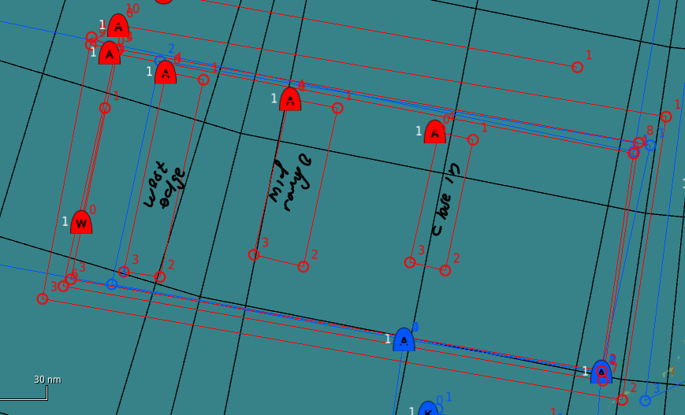

# Range 33
rev 1.7

## Air to Air trainer
The Air to Air training system provides both BFM and BVR training drones. The drones are deployed as CAP flights orginating in one of three patrol zones. The patrol zones for Range 33 range from west to east. Measued from the Range East edge they are:  
- Far out - 150nm
- Mid range - 100nm
- CLose in - 60nm
4 configurable groups make presetting your requirement easy. There is no limit to the number of spawnable groups yet.  

## Drone units
The system currently includes: 
- **MIG23MLD** (*APU602M*, R24R)
- **MIG29A** (*R60M*, R73, R27R)
- **SU30** (*R73*, R77, R27ER)
- **JF17** (*PL-5EII*, SD10-A)
- MIG25PD (*R40TD*, R40RD)
- MIG31 (*R73*, R77, R29ER)
- SU27 (*R73*, R27ET, R27ER)
- J11A (*R73*, R27ER, R77)

\* *italics* shows the BFM load  
\* **bold** shows the default group airframes. 

## Control
Select mode **BVR** or BFM  
This defines the load and max detection range of the drone groups.  
BVR max detection range ~120nm.  
BFM max detection range ~30nm. 

Groups 1-4 allow the configuration of your required engagement airframes that can be configured through the Group Config Menu even before you leave the ground. 

## Enemy ROE
- Drones groups execute a CAP mission in the vacinity of their spawn zone when they are first spawned. 
- Drones will only engage targets inside the range.
- Max detection range is only the possible maximum, it might be short (DCS mechanics)
- Engagement range is not configurable. (see note)
- If the drones leave the range, they will return to their initial mission. 

*Note: the engagement range is defined as maximum range in the drone templates, but their skill is set to average else they are impossible to beat, the side effect is that low skilled drones engage closer. There is no way around this.*

## Back
[Back to frontpage](https://132nd-vwing.github.io/TRMA-Brief/)
